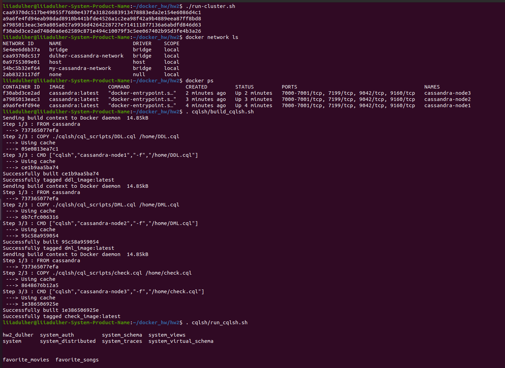
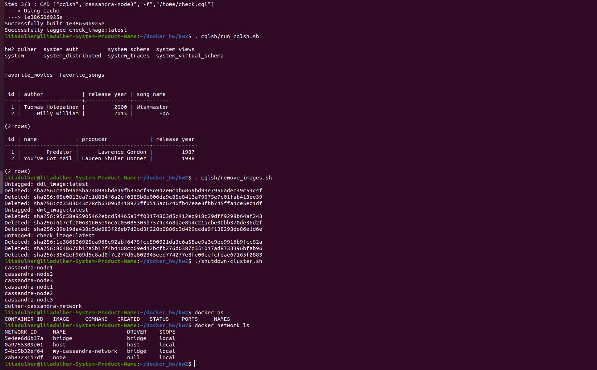

# Docker hw2
Cassandra 1

## TODO: add folders structure, yaml

## Team: [Liia_Dulher](https://github.com/LiiaDulher)

### Important
It takes about 65 seconds for Cassandra node to start, so <i>run-cluster.sh</i> will run about <b>3,5 minutes</b>.

### Usage
````
$ sudo chmod +x run-cluster.sh
$ sudo chmod +x shutdown-cluster.sh
$ sudo chmod +x cqlsh/build_cqlsh.sh
$ sudo chmod +x cqlsh/run_cqlsh.sh
$ sudo chmod +x cqlsh/remove_images.sh
$ ./run-cluster.sh
$ . cqlsh/build_cqlsh.sh
$ . cqlsh/run_cqlsh.sh
$ . cqlsh/remove_images.sh
$ ./shutdown-cluster.sh
````
## Directory structure
├── app
│   ├── css
│   │   ├── **/*.css
│   ├── favicon.ico
│   ├── images
│   ├── index.html
│   ├── js
│   │   ├── **/*.js
│   └── partials/template
├── dist (or build)
├── node_modules
├── bower_components (if using bower)
├── test
├── Gruntfile.js/gulpfile.js
├── README.md
├── package.json
├── bower.json (if using bower)
└── .gitignore

## Results


